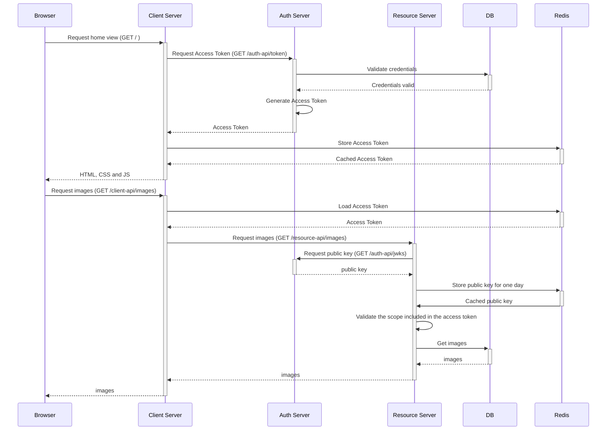
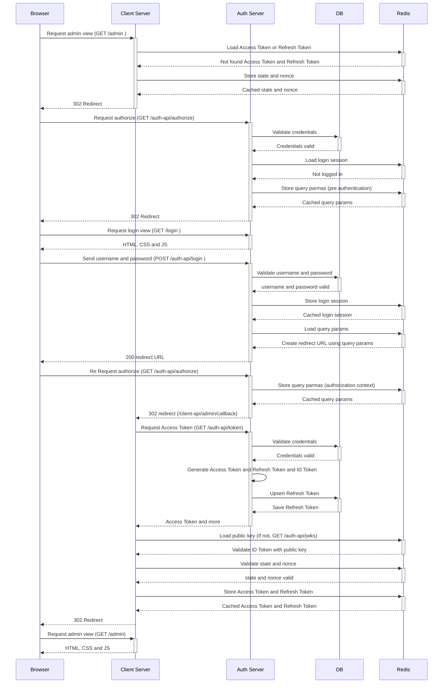
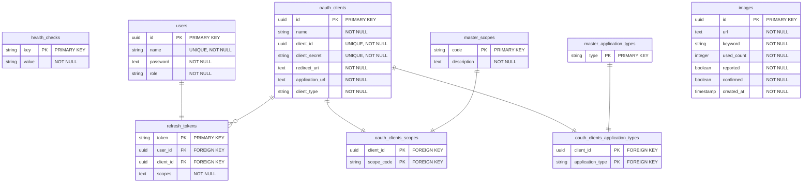

# LGTMeme
LGTMeme is a simple LGTM (Looks Good To Me) image creation service. You can quickly insert LGTM characters into your favorite image and copy markdown to the clipboard. Brighten up the monotonous code review and approval process with humorous LGTM image.


## URL


## Endpoints

<details>
<summary><b>Auth server</b></summary>

| Endpoint                   | Path                        |
| :------------------------- | :-------------------------- |
| Authorization Endpoint     | `/auth-api/authorize`       |
| Health Check               | `/auth-api/health`    |
| Token Endpoint             | `/connect/token`            |
| Login Form                 | `/login`                    |
| Access Token JWKS Endpoint | `/internal/v1/connect/jwks` |
| ID Token JWKS Endpoint     | `/connect/jwks`             |
</details>


## Supported Authentication/Authorization flow
<details>
<summary><b>Client Credentials Flow (with GET images)</b></summary>


</details>


<details>
<summary><b>Authorization Code Flow (Transition to admin screen)</b></summary>


</details>


## Diagrams
<details>
<summary><b>Folder configuration diagram</b></summary>

```
lgtmeme/
├── .github/         # GitHub Actions configurations
├── .vscode/         # Visual Studio Code settings files
├── cmd/             # Application's entry point
│   └── lgtmeme/
│       └── main.go  # main function
├── config/          # Configuration files (DB, logger, constants, etc.)
├── db/              # Migration files and seed data for development
├── docker/          # Docker files
├── internal/        # Application's source code
│   ├── dto/         # Data Transfer Object structures
│   ├── handler/     # HTTP handlers (controllers)
│   ├── middleware/  # Middleware
│   ├── model/       # Data models
│   ├── repository/  # Data access layer (DB, Redis)
│   ├── service/     # Internal and external API requests and business logic
│   └── util/        # Utility functions and wrappers
├── script/          # Scripts files
├── test/            # Endpoint tests
└── view/            # Next.js
     ├── out/        # Static files exported by SSG
     └── src/        # Next.js source code
```
</details>

<details>
<summary><b>ER diagram</b></summary>


</details>


<details>
<summary><b>Architecture diagram</b></summary>

```mermaid

```
</details>


## Developer knowledge

## Redis
```
docker exec -it lgtmeme_redis redis-cli
keys *
get [key]
```

## Grant execution permission to the script
```
chmod +x ./script/*.sh
```

## Generate RSA key pair
```
openssl genpkey -algorithm RSA -out private_key.pem -pkeyopt rsa_keygen_bits:2048
openssl rsa -pubout -in private_key.pem -out public_key.pem
cat private_key.pem | base64 | tr -d '\n'
cat public_key.pem | base64 | tr -d '\n'