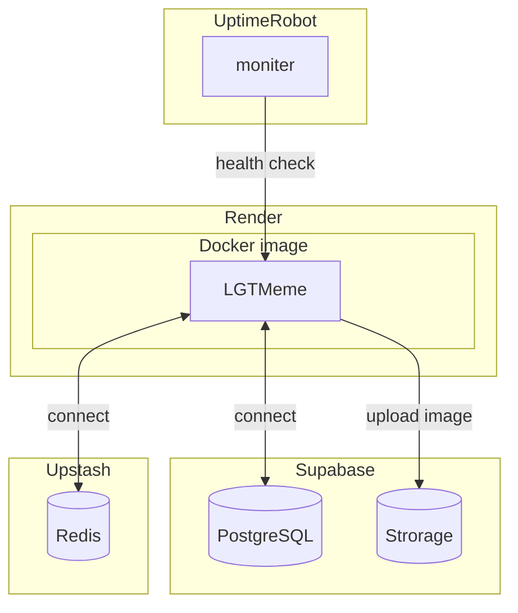

# Architecture

```mermaid
graph TD;
  subgraph "Render"
    subgraph "Docker image"
      LGTMeme[LGTMeme]
    end
  end
  subgraph "Supabase"
    PostgreSQL[(PostgreSQL)]
    Storage[(Strorage)]
  end
  subgraph "Upstash"
    Redis[(Redis)]
  end
  subgraph "UptimeRobot"
    monitor[moniter]
  end
  LGTMeme<--connect-->PostgreSQL;
  LGTMeme--upload image-->Storage;
  LGTMeme<--connect-->Redis;
  monitor--health check-->LGTMeme;
```