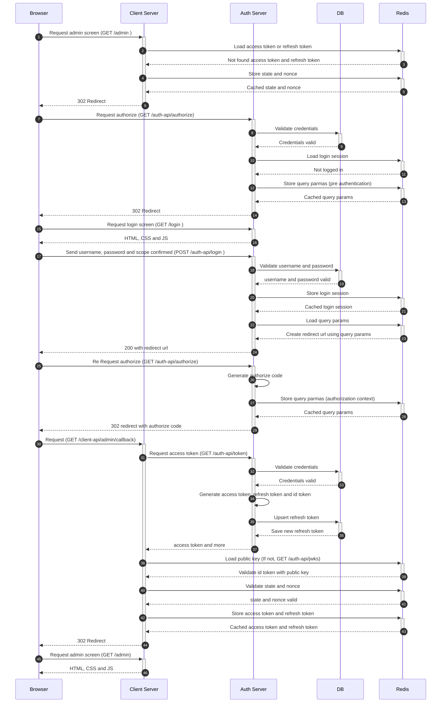

# Authorization Code Grant Flow (with transition to admin screen)

```mermaid
sequenceDiagram
  participant browser as Browser
  participant client_server as Client Server
  participant auth_server as Auth Server
  participant db as DB
  participant Redis as Redis

  autonumber
  browser->>+client_server: Request admin screen (GET /admin )
  client_server->>+Redis: Load access token or refresh token
  Redis-->>-client_server: Not found access token and refresh token
  client_server->>+Redis: Store state and nonce
  Redis-->>-client_server: Cached state and nonce
  client_server-->>-browser: 302 Redirect
  browser->>+auth_server: Request authorize (GET /auth-api/authorize)
  auth_server->>+db: Validate credentials
  db-->>-auth_server: Credentials valid
  auth_server->>+Redis: Load login session
  Redis-->>-auth_server: Not logged in
  auth_server->>+Redis: Store query parmas (pre authentication)
  Redis-->>-auth_server: Cached query params
  auth_server-->>-browser: 302 Redirect
  browser->>+auth_server: Request login screen (GET /login )
  auth_server-->>-browser: HTML, CSS and JS
  browser->>+auth_server: Send username, password and scope confirmed (POST /auth-api/login )
  auth_server->>+db: Validate username and password
  db-->>-auth_server: username and password valid
  auth_server->>+Redis: Store login session
  Redis-->>-auth_server: Cached login session
  auth_server->>+Redis: Load query params
  Redis-->>-auth_server: Create redirect url using query params
  auth_server-->>-browser: 200 with redirect url
  browser->>+auth_server: Re Request authorize (GET /auth-api/authorize)
  auth_server->>auth_server: Generate authorize code
  auth_server->>+Redis: Store query parmas (authorization context)
  Redis-->>-auth_server: Cached query params
  auth_server-->>-browser: 302 redirect with authorize code
  browser->>+client_server: Request (GET /client-api/admin/callback)
  client_server->>+auth_server: Request access token (GET /auth-api/token)
  auth_server->>+db: Validate credentials
  db-->>-auth_server: Credentials valid
  auth_server->>auth_server: Generate access token, refresh token and id token
  auth_server->>+db: Upsert refresh token
  db-->>-auth_server: Save new refresh token
  auth_server-->>-client_server: access token and more
  client_server->>+Redis: Load public key (If not, GET /auth-api/jwks)
  Redis-->>-client_server: Validate id token with public key
  client_server->>+Redis: Validate state and nonce
  Redis-->>-client_server: state and nonce valid
  client_server->>+Redis: Store access token and refresh token
  Redis-->>-client_server: Cached access token and refresh token
  client_server-->>-browser: 302 Redirect
  browser->>+client_server: Request admin screen (GET /admin)
  client_server-->>-browser: HTML, CSS and JS
```