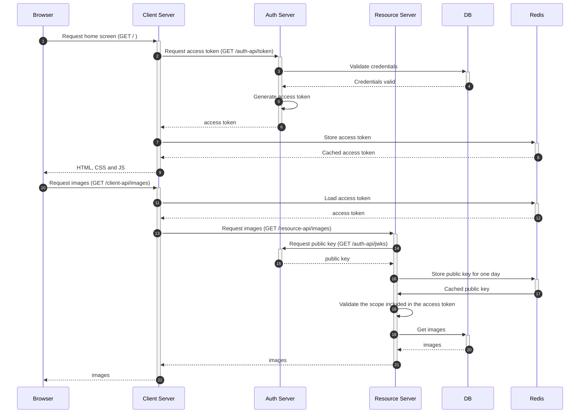

# Client Credentials Grant Flow (with GET images)

```mermaid
sequenceDiagram
  participant browser as Browser
  participant client_server as Client Server
  participant auth_server as Auth Server
  participant resource_server as Resource Server
  participant db as DB
  participant Redis as Redis

  autonumber
  browser->>+client_server: Request home screen (GET / )
  client_server->>+auth_server: Request access token (GET /auth-api/token)
  auth_server->>+db: Validate credentials
  db-->>-auth_server: Credentials valid
  auth_server->>auth_server: Generate access token
  auth_server-->>-client_server: access token
  client_server->>+Redis: Store access token
  Redis-->>-client_server: Cached access token
  client_server-->>-browser: HTML, CSS and JS
  browser->>+client_server: Request images (GET /client-api/images)
  client_server->>+Redis: Load access token
  Redis-->>-client_server: access token
  client_server->>+resource_server: Request images (GET /resource-api/images)
  resource_server->>+auth_server: Request public key (GET /auth-api/jwks)
  auth_server-->>-resource_server: public key
  resource_server->>+Redis: Store public key for one day
  Redis->>-resource_server: Cached public key
  resource_server->>resource_server: Validate the scope included in the access token
  resource_server->>+db: Get images
  db-->>-resource_server: images
  resource_server-->>-client_server: images
  client_server-->>-browser: images
```