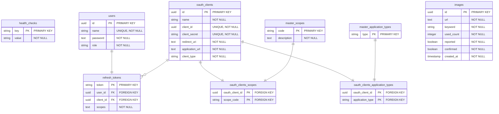

# ER diagram

### health_checks
A table for health check. Check the connection to the DB and make sure supabase does not stop.
| Column                     | Type                    | Description                                                                     |
| -------------------------- | ----------------------- | --------------------------------------------------------------------------------|
| key                        | string                  | Primary key                                                                     |
| value                      | string                  | value                                                                           |

### users
A table for storing user information.
| Column                     | Type                    | Description                                                                     |
| -------------------------- | ----------------------- | --------------------------------------------------------------------------------|
| id                         | uuid                    | Primary key                                                                     |
| name                       | string                  | Unique username, not null                                                       |
| password                   | text                    | Encrypted password, not null                                                    |
| role                       | string                  | User role within the system, not null, `Admin` or `member`                      |

### oauth_clients
A table for storing OAuth client details.
| Column                     | Type                    | Description                                                                     |
| -------------------------- | ----------------------- | --------------------------------------------------------------------------------|
| id                         | uuid                    | Primary key                                                                     |
| name                       | string                  | Client name, not null                                                           |
| client_id                  | uuid                    | Unique client identifier, not null                                              |
| client_secret              | string                  | Unique client secret for authorization, not null                                |
| redirect_uri               | text                    | URI for redirecting after authorization, not null                               |
| application_url            | text                    | URL of the client application, not null                                         |
| client_type                | string                  | Type of client, not null, `confidential` or `public`                            |

### master_scopes
A master table for defining the scopes of access available within the system.
| Column                     | Type                    | Description                                                                     |
| -------------------------- | ----------------------- | --------------------------------------------------------------------------------|
| code                       | string                  | Primary key                                                                     |
| description                | text                    | Description of the scope, not null                                              |

### oauth_clients_scopes
A junction table linking OAuth clients and their scopes.
| Column                     | Type                    | Description                                                                     |
| -------------------------- | ----------------------- | --------------------------------------------------------------------------------|
| oauth_client_id            | uuid                    | Foreign key to OAuth clients, primary key                                       |
| scope_code                 | string                  | Foreign key to master scopes, primary key                                       |

### master_application_types
A master table for storing application types.
| Column                     | Type                    | Description                                                                     |
| -------------------------- | ----------------------- | --------------------------------------------------------------------------------|
| type                       | string                  | Application type, `web`                                                         |

### oauth_clients_application_types
A junction table linking OAuth clients to application types.
| Column                     | Type                    | Description                                                                     |
| -------------------------- | ----------------------- | --------------------------------------------------------------------------------|
| oauth_client_id            | uuid                    | Foreign key to OAuth clients, primary key                                       |
| application_type           | string                  | Foreign key to master application types, primary key                            |

### refresh_tokens
A table for storing refresh tokens for OAuth.
| Column                     | Type                    | Description                                                                     |
| -------------------------- | ----------------------- | --------------------------------------------------------------------------------|
| token                      | string                  | Refresh Token                                                                   |
| user_id                    | uuid                    | Foreign key to users                                                            |
| client_id                  | uuid                    | Foreign key to OAuth clients                                                    |
| scopes                     | text                    | Scopes associated with the refresh token, not null                              |

### images
A table that stores LGTM image information.
| Column                     | Type                    | Description                                                                     |
| -------------------------- | ----------------------- | --------------------------------------------------------------------------------|
| id                         | uuid                    | Primary key                                                                     |
| url                        | text                    | URL of the image, not null                                                      |
| keyword                    | string                  | Keyword associated with the image, not null                                     |
| used_count                 | integer                 | Count of how many times the image has been used, not null                       |
| reported                   | boolean                 | Flag indicating if the image has been reported, not null                        |
| confirmed                  | boolean                 | Flag indicating if the image's content has been confirmed, not null             |
| created_at                 | timestamp               | Timestamp when the image was added, not null                                    |
