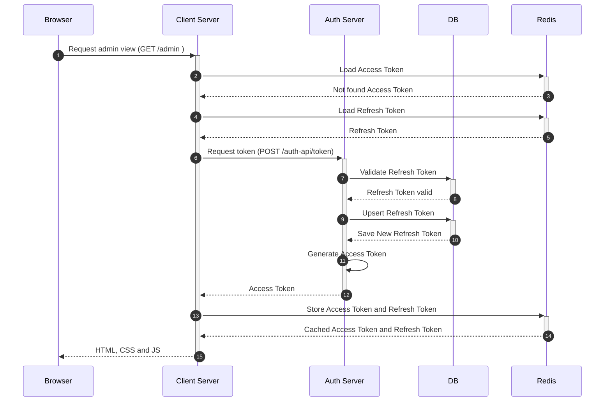

# Refresh Token Grant Flow (with transition to admin view)

```mermaid
sequenceDiagram
  participant browser as Browser
  participant client_server as Client Server
  participant auth_server as Auth Server
  participant db as DB
  participant Redis as Redis

  autonumber
  browser->>+client_server: Request admin view (GET /admin )
  client_server->>+Redis: Load Access Token
  Redis-->>-client_server: Not found Access Token
  client_server->>+Redis: Load Refresh Token
  Redis-->>-client_server: Refresh Token
  client_server->>+auth_server: Request token (POST /auth-api/token)
  auth_server->>+db: Validate Refresh Token
  db-->>-auth_server: Refresh Token valid
  auth_server->>+db: Upsert Refresh Token
  db-->>-auth_server: Save New Refresh Token
  auth_server->>auth_server: Generate Access Token
  auth_server-->>-client_server: Access Token
  client_server->>+Redis: Store Access Token and Refresh Token
  Redis-->>-client_server: Cached Access Token and Refresh Token
  client_server-->>-browser: HTML, CSS and JS
```