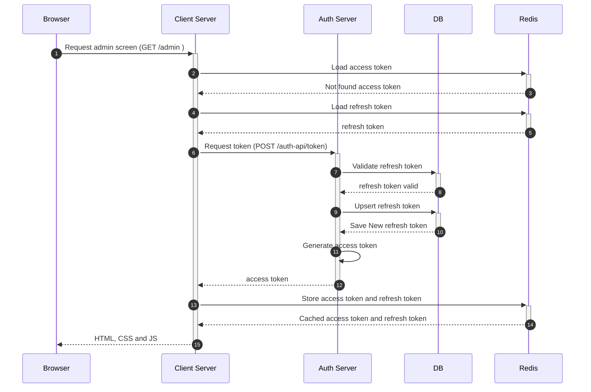

# refresh token Grant Flow (with transition to admin screen)

```mermaid
sequenceDiagram
  participant browser as Browser
  participant client_server as Client Server
  participant auth_server as Auth Server
  participant db as DB
  participant Redis as Redis

  autonumber
  browser->>+client_server: Request admin screen (GET /admin )
  client_server->>+Redis: Load access token
  Redis-->>-client_server: Not found access token
  client_server->>+Redis: Load refresh token
  Redis-->>-client_server: refresh token
  client_server->>+auth_server: Request token (POST /auth-api/token)
  auth_server->>+db: Validate refresh token
  db-->>-auth_server: refresh token valid
  auth_server->>+db: Upsert refresh token
  db-->>-auth_server: Save New refresh token
  auth_server->>auth_server: Generate access token
  auth_server-->>-client_server: access token
  client_server->>+Redis: Store access token and refresh token
  Redis-->>-client_server: Cached access token and refresh token
  client_server-->>-browser: HTML, CSS and JS
```